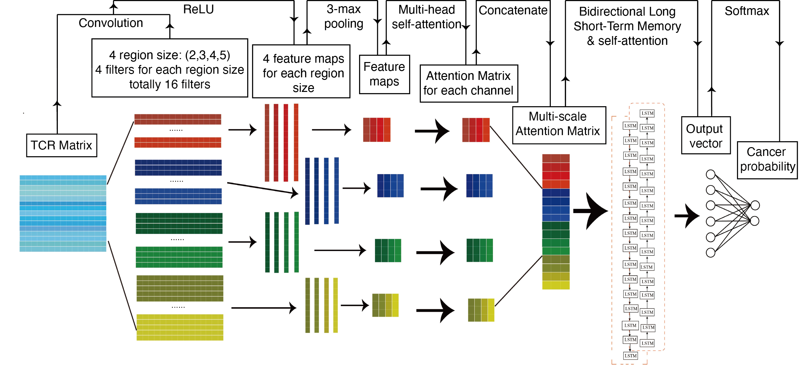

# DeepCaTCR
## A Deep Learning Framework for Early Cancer Detection via TCR Repertoire
DeepCaTCR is an advanced deep learning framework designed to enhance prediction accuracy for identifying early-stage cancer patients through T-cell receptor (TCR) repertoire. This tool leverages state-of-the-art neural networks to extract meaningful patterns from TCR sequences, enabling non-invasive cancer detection.
<p float="left">
  
</p>

### Installation

From Source:

```
 git clone https://github.com/tang997/DeepCaTCR.git
 cd DeepCaTCR
```

### Python package versions

Running the DeepCaTCR requires the Python packages:

```
Python          3.8.10
numpy           1.21.4
torch           1.10.0+cu113
matplotlib      3.5.0
scikit-learn    1.3.2
```
## Usage Guide
### Using Pre-trained Models
Predict cancer scores for TCR repertoire samples:
```
python Repertoire_prection.py --input_dir example_repertoire --output_dir repertoire_score --model_path pre-trained_model/my_test_DeepCaTCR_best_model.pth 
```
Output format (repertoire_score/cancer_score.csv):
```
Sample,meanscore,variance
HIP5_CD8_mem_3of4.csv_ClusteredCDR3s_7.5.txt,0.300047116299764,0.06557724538907739
HIP5_CD8_mem_4of4.csv_ClusteredCDR3s_7.5.txt,0.29473790610951495,0.061405114820069336
HIP5_CD8_naive_1of3.csv_ClusteredCDR3s_7.5.txt,0.13423678138043763,0.031599820906940995
HIP5_CD8_mem_1of4.csv_ClusteredCDR3s_7.5.txt,0.27335596794187256,0.05694339281784166
......
```

### Evaluating Model Performance

Assess pre-trained model metrics:

```
python DeepCaTCR.py --evaluate --record_dir pre-trained_model --sample_name my_test
```
Output (model_performance/evaluation_results.txt):
```
Model Evaluation Results:
Model: my_test_DeepCaTCR_best_model.pth
ACC: 0.8072
AUC: 0.8643
SEN: 0.6041
SPE: 0.9084
F1: 0.6758
MCC: 0.5492
```

### Visualizing Predictive Motifs

Generate interpretable motif visualizations:

```
python DeepCaTCR.py --visualize --record_dir pre-trained_model --sample_name my_test
```
Output: SVG files containing motif visualizations in `model_performance/`

### Training DeepCaTCR

Train your own DeepCaTCR model:

```
python DeepCaTCR.py --train --record_dir Results --sample_name my_test
```
### Dataset split

Split dataset into training and test sets:

```
python dataset_split.py
```
Output (dataset_split_info.txt):
```
Random Seed: 42
caTCRs Dataset: Total=30000, Train=24000, Test=6000
non-caTCRs Dataset: Total=59851, Train=47880, Test=11971
```