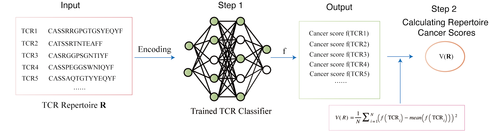

# DeepCaTCR
DeepCaTCR is a deep learning framework, aimed at enhancing the prediction accuracy for identifying early-stage cancer patients
using TCR repertoire.
<p float="left">
  
</p>

### Installation

From Source:

```
 git clone https://github.com/tang997/DeepCaTCR.git
 cd DeepTRB
```
Running the DeepCaTCR requires python3.6, numpy version 1.19.2, torch version 1.6.0, torchvision version 0.7.0, 
pandas version 1.1.2 and scikit-learn version 0.24.2 to be installed. 

If they are not installed on your environment, please first install numpy, pandas, and scikit-learn
by running the following command:

```
 pip install -r requirements.txt
```
Next, Please select the most suitable command from the following options to install torch and torchvision 
based on your terminal’s specific situation:

For OSX:
```
 pip install torch==1.6.0 torchvision==0.7.0
```

For Linux and Windows:
```
# CUDA 10.2
pip install torch==1.6.0 torchvision==0.7.0

# CUDA 10.1
pip install torch==1.6.0+cu101 torchvision==0.7.0+cu101 -f https://download.pytorch.org/whl/torch_stable.html

# CUDA 9.2
pip install torch==1.6.0+cu92 torchvision==0.7.0+cu92 -f https://download.pytorch.org/whl/torch_stable.html

# CPU only
pip install torch==1.6.0+cpu torchvision==0.7.0+cpu -f https://download.pytorch.org/whl/torch_stable.html
```


